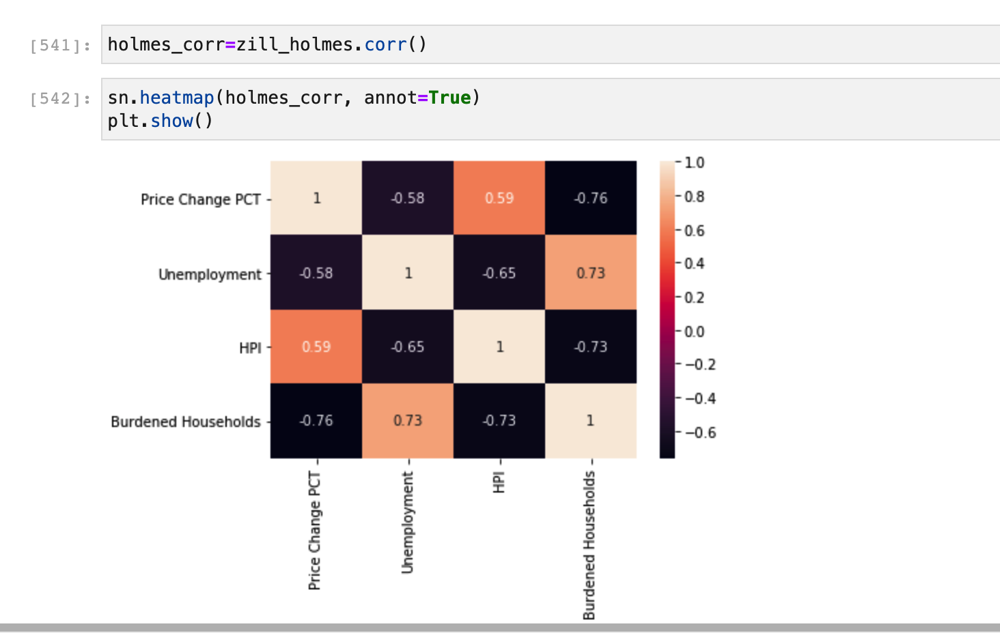
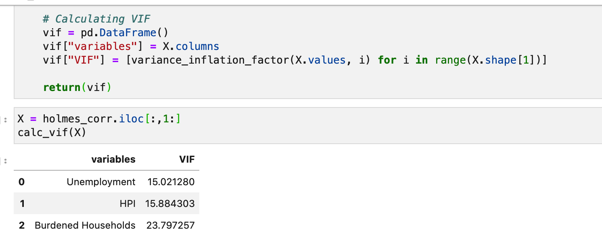
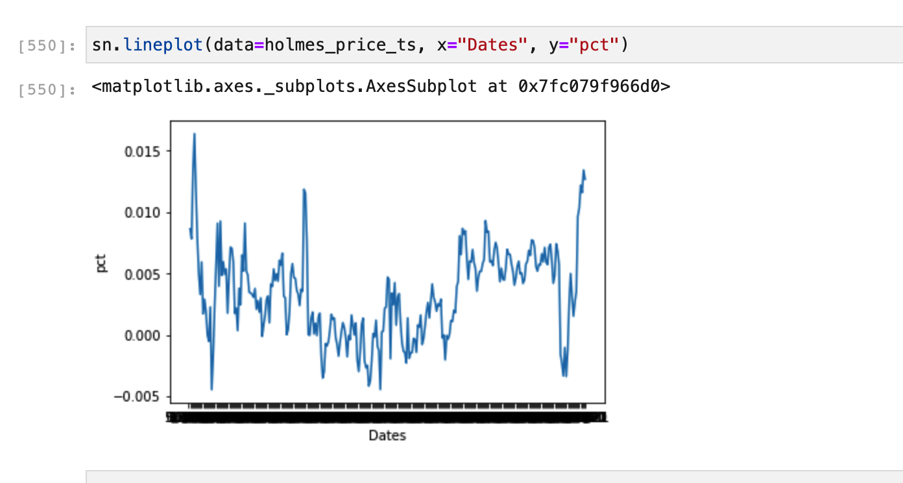
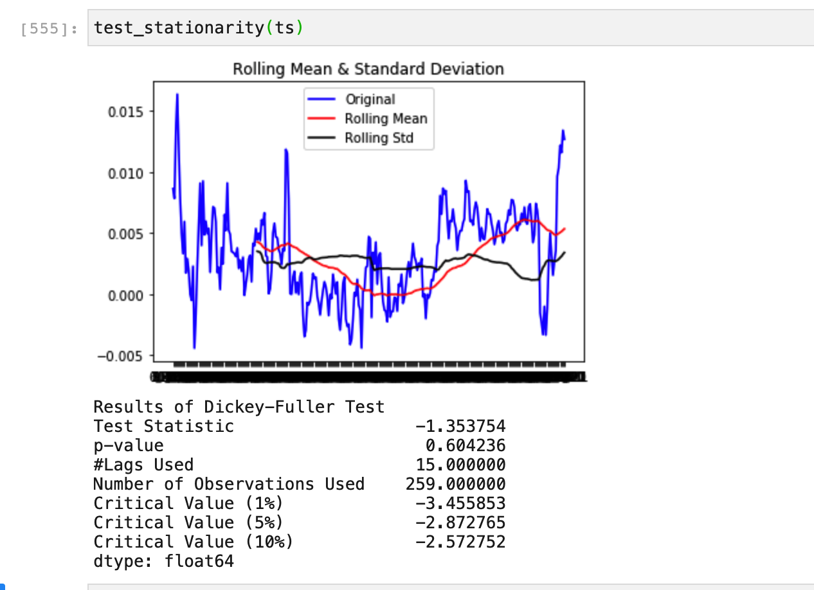
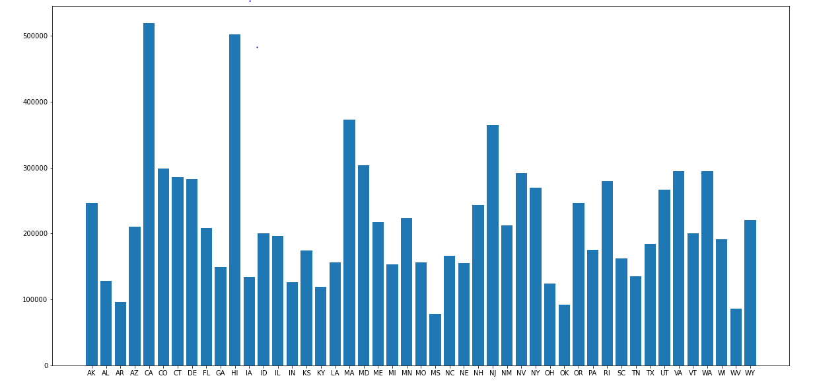
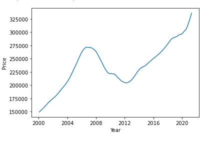
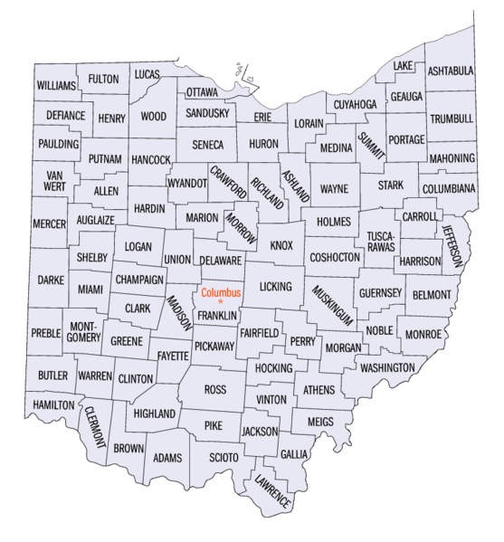
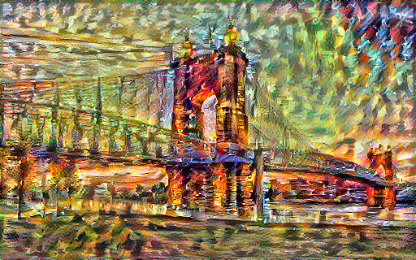
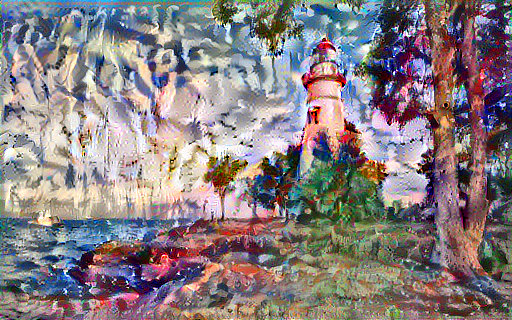

# Welcome to OHIO State NFT!

Our group has been hired to do Real Estate analysis on the State of Ohio. By using Linear regression and financial data of the state we were able to determine the top 3 counties.

To run the notebooks, please install the requirements using the command below.

```python -m pip install -r requirements.txt```

Additional programs needed to download/install are in the [Dependency](Dependency/Downloads.md)

---
---

### Analysis

Time series stationarity tests.









National Level Analysis






### Top 3 Counties of places to move to in Ohio per our analysis.

1. Holmes County, OH
2. Mercer County, OH
3. Auglaize County, OH



---
---


## Art NFT for Auction

> Neural style transfer art - an optimization technique used to take two images a content image and a style reference image and blend them together so the output image looks like the content image, but “painted” in the style of the style reference image.

### 1. John A. Roebling Suspension Bridge in Cincinnati, OH 




### 2. The Ohio Statehouse in Columbus, OH 


### 3. Marblehead Lighthouse in Marblehead, Ohio



Promotional NFT’s focus on promoting a place, event, person, or item.
Our NFT’s have extra goodies per the State of Ohio including:
1. An art piece (NFT)
2. One time flights to Ohio to any of the three counties
3. One time two-day stay with hotel 
4. A one year access to our real estate information and predictive model.


---
---

## NFT Code

Below are two short videos of the Real Estate Auction Smart Contracts


## 9. Link to our code ##

* [Analysis](Code/Analysis/Analysis_Notebook.ipynb)
* [Neural Transfer](Code/Neural_Transfer/tensor.ipynb)
* [NFT](Code/NFT/RE_market)
* [Resources](Clean)
* [Visualization](Files)

